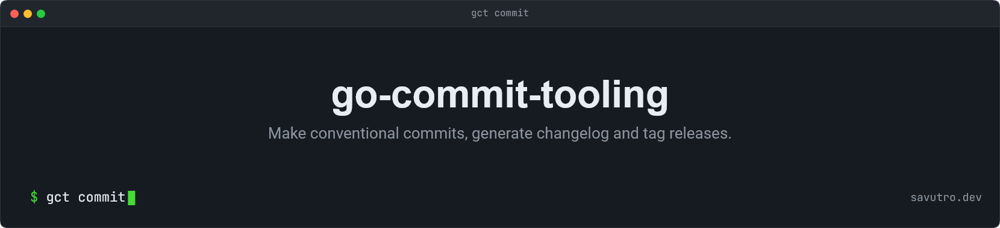

## 

[](https://github.com/savutro/go-commit-tooling/actions/workflows/go-release.yml)
[](https://github.com/savutro/go-commit-tooling/tags)
[](go.mod)
[](https://www.conventionalcommits.org/)
[](LICENSE)

`gct` is an interactive Go CLI for teams that want Git hygiene without ceremony. It helps you stage files intentionally, write understandable Conventional Commits, generate changelogs, maintain a plain `VERSION` file, and create release commits plus tags for CI/CD.

The main workflow is:

```powershell
gct add
gct commit
gct release
```

## Why This Exists

Most projects eventually grow the same release chores:

- selecting exactly the files that belong in a commit
- choosing the right Conventional Commit type
- remembering when a change is breaking
- keeping `CHANGELOG.md` and `VERSION` in sync
- tagging releases in a way CI/CD can trust

`gct` keeps those steps in one small tool. The CLI is interactive by default, but the output artifacts are intentionally simple: Git commits, Git tags, Markdown, and a plain text version file.

## Installation

Build from source:

```powershell
go build -o bin/gct.exe ./cmd/gct
```

Run during development:

```powershell
go run ./cmd/gct help
```

Install globally from a checkout:

```powershell
go install ./cmd/gct
```

## Commands

### `gct add`

Opens an interactive staging picker based on `git status`.

- Checked files are staged.
- Unchecked files that were previously staged are unstaged.
- Untracked, modified, deleted, and renamed files are shown with their Git status.
- Use arrow keys to move, space to toggle, `/` to filter, and enter to confirm.

This is meant to replace the common `git add -p` or `git add .` moment with a clearer file-level check-in/check-out step.

### `gct commit`

Builds a Conventional Commit message with an arrow-key form.

```text
type(scope)!: description

body

footer
```

The type picker gives each type a plain-language description:

- `feat`: user-facing behavior or public capability
- `fix`: bug fix or regression fix
- `docs`: documentation-only change
- `style`: formatting-only change
- `refactor`: restructuring without feature or bug-fix intent
- `perf`: runtime, memory, startup, or efficiency improvement
- `test`: test-only change
- `build`: build system, dependency, package, or artifact change
- `ci`: workflow, delivery, or automation change
- `chore`: maintenance that does not fit another type
- `revert`: explicit revert of an earlier commit

After previewing the message, `gct` can run `git commit` for you.

### `gct release`

Creates a release commit and tag, then publishes both to GitHub by default.

The command:

1. Requires a clean working tree.
2. Looks at commits since the latest `vX.Y.Z` tag.
3. Warns when breaking commits are present.
4. Suggests a semantic version bump.
5. Writes `VERSION`.
6. Regenerates `CHANGELOG.md`.
7. Commits those artifacts as `chore(release): vX.Y.Z`.
8. Creates an annotated `vX.Y.Z` tag.
9. Pushes the current branch and the new tag to `origin`.

Use a different remote when needed:

```powershell
gct release --remote upstream
```

Keep the release local when you want to inspect it before publishing:

```powershell
gct release --no-push
```

The tag is what triggers release publishing in CI/CD. The default flow pushes it for you so you do not need to remember `git push origin main --follow-tags`.

### `gct generate`

Generates `CHANGELOG.md` from Git history.

```powershell
gct generate
gct generate -s
gct generate --version 1.4.0
gct generate -o docs/CHANGELOG.md
```

Behavior:

- Groups released commits under semantic version tags such as `v1.2.3`.
- Shows commits after the latest tag under `Unreleased`.
- Skips release bookkeeping commits like `chore(release): v1.2.3`.
- Includes footer references such as `Closes #123`.
- `-s` includes only commits that follow Conventional Commits.

### `gct version`

Writes a plain semantic `VERSION` file.

```text
1.4.2
```

The file is intentionally boring so pipelines, Docker builds, Go release jobs, and static site deployments can read it without app-specific parsing.

## What about the commands `generate` and `version`?

They are no longer the path for normal releases. `gct release` is better because it updates `VERSION`, regenerates `CHANGELOG.md`, commits both together, and creates the tag in one flow.

They are still useful as lower-level commands:

- `gct generate` is useful in CI checks, documentation-only changelog previews, migration work, or when you want to regenerate release notes without tagging.
- `gct version` is useful for projects where another release system handles changelogs and tags, but still expects a plain `VERSION` file.
- Both commands are useful for debugging and for teams that want to adopt the workflow gradually.

So they are not obsolete, but they should be treated as building blocks. For day-to-day releases, prefer `gct release`.

## CI/CD

This repository uses the Go release workflow in [.github/workflows/go-release.yml](.github/workflows/go-release.yml).

The flow:

- Pull requests: test and build only.
- Pushes to `main`: test and build only.
- Tags like `v1.2.3`: publish release artifacts.

## Project Layout

```text
cmd/gct/                 CLI entrypoint
internal/cli/            command routing
internal/commit/         Conventional Commit builder and parser
internal/stage/          interactive Git staging
internal/changelog/      changelog generation
internal/version/        semantic version handling
internal/release/        release orchestration
internal/gitutil/        Git command wrappers
internal/tui/            shared TUI defaults
docs/github-actions/     reusable workflow templates
```

## Development

Run checks:

```powershell
go test ./...
go vet ./...
go build -o bin/gct.exe ./cmd/gct
```

## License

GPLv3. See [LICENSE](LICENSE).
